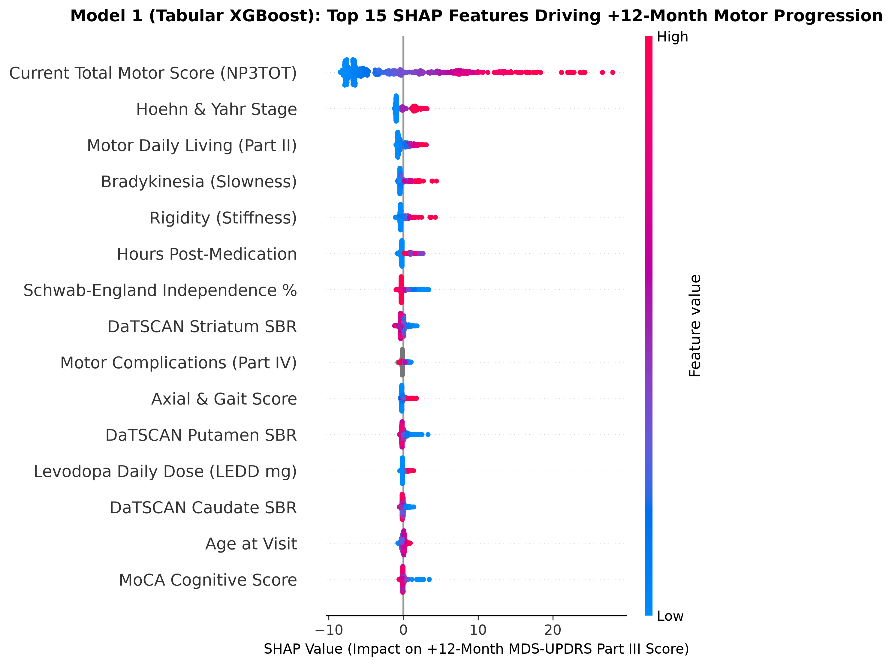

# Multimodal Longitudinal Modeling of Parkinson's Disease Progression

[](https://www.python.org/)
[](LICENSE)
[](https://www.ppmi-info.org/)
[]()

A comprehensive multimodal machine learning and deep learning framework to detect, track, and forecast **Parkinson's Disease (PD) motor progression** over 12- and 24-month horizons using longitudinal data from the **Parkinson's Progression Markers Initiative (PPMI)** cohort.

---

## 🎯 Project Overview & Research Questions

Parkinson's disease is the second most prevalent neurodegenerative disorder worldwide, characterized by progressive loss of dopaminergic neurons in the substantia nigra. Progression rates vary drastically from patient to patient. This project addresses two primary clinical research questions:

* **Research Question 1 (RQ1 - Longitudinal Sequence Value):**  
  *Can disease progression (MDS-UPDRS Part III `NP3TOT`) at $+12$ and $+24$ months be predicted more accurately from longitudinal visit trajectories than from a single static clinic visit snapshot?*
* **Research Question 2 (RQ2 - Multimodal Fusion Architecture):**  
  *Which fusion strategy (Early, Late, or Cross-Modal Attention) of clinical, cognitive, biospecimen, and neuroimaging modalities yields the highest accuracy and temporal stability?*

---

## 📊 Dataset & Modalities (PPMI Cohort)

The pipeline integrates **32,743 longitudinal in-clinic visits** across **5,426 patients** (including 1,829 confirmed PD, 340 Healthy Controls, and 3,176 Prodromal participants) followed for up to 10+ years:

```
Multimodal Input Streams (Visit t)
├── 1. Motor Assessments (MDS-UPDRS Part III: Tremor, Rigidity, Bradykinesia, Axial, H&Y Stage)
├── 2. Medication Confounder Control (Active Levodopa Equivalent Daily Dose - LEDD mg & PDSTATE ON/OFF)
├── 3. Non-Motor Questionnaires (MoCA Cognitive, SCOPA Autonomic, GDS Depression, Sleep, UPSIT Smell)
├── 4. Fluid Biospecimens (CSF Aβ42, t-tau, p-tau-181, α-synuclein, NfL, and SAA Seed Clumping Status)
└── 5. Quantitative Neuroimaging (DaTSCAN SPECT SBR Caudate/Putamen & FreeSurfer Structural MRI Volumes)
```

---

## 🛡️ Strict Anti-Leakage Specification

To maintain clinical validity and avoid inflated performance:
1. **Patient-Level Partitioning:** All splits are strictly partitioned by `PATNO`. A patient appears in **only one** partition (Train $\cap$ Val = $\emptyset$, Train $\cap$ Test = $\emptyset$, Val $\cap$ Test = $\emptyset$).
2. **Temporal Arrow of Time:** Features computed at visit time $t$ utilize **zero observations** from $t' > t$. Future visits only supply the prediction targets (`target_np3tot_12m`, `target_np3tot_24m`).
3. **Partition Summary:**
   * **Train Set:** 22,980 visits across 3,787 patients (2,683 with labeled progression targets)
   * **Validation Set:** 4,831 visits across 827 patients (574 with labeled progression targets)
   * **Held-Out Test Set:** 4,932 visits across 812 patients (583 with labeled progression targets)

---

## 📈 Benchmark Results (Held-Out Test Set: 583 Patients)

All models are evaluated on the **held-out test set** using the unified harness (`src/evaluate.py`).

| Model Architecture | Input Modalities | Horizon | MAE (pts) | RMSE (pts) | Pearson $r$ | $R^2$ Variance | ROC-AUC (Worsening) |
| :--- | :--- | :---: | :---: | :---: | :---: | :---: | :---: |
| **Model 1: Tabular XGBoost (Static Snapshot)** | Multimodal Tabular | $+12$ Months | **4.711** | **6.867** | **0.881** | **0.7740 (77.4%)** | — |
| **Model 1: Tabular XGBoost (Static Snapshot)** | Multimodal Tabular | $+24$ Months | **4.971** | **7.319** | **0.867** | **0.7506 (75.1%)** | — |
| **Model 1: XGBoost Classifier** | Multimodal Tabular | $+12$m ($\ge 3.5$ pts) | — | — | — | — | **0.7099** (PR: 0.552) |
| **Model 2: Longitudinal BiLSTM (Sequences)** | Multi-visit Trajectories | $+12$ Months | **4.792** | **7.125** | **0.870** | **0.7567 (75.7%)** | — |
| **Model 2: Longitudinal BiLSTM (Sequences)** | Multi-visit Trajectories | $+24$ Months | **4.840** | **7.126** | **0.874** | **0.7636 (76.4%)** | — |
| **Model 2: BiLSTM Classifier** | Multi-visit Trajectories | $+12$m ($\ge 3.5$ pts) | — | — | — | — | **0.6863** (PR: 0.469) |
| *Model 3: Monomodal Neuroimaging* | DaTSCAN + MRI alone | $+12$ Months | *Upcoming* | — | — | — | — |
| *Model 4: Cross-Modal Attention Fusion* | Full Multimodal Streams | $+12$ & $+24$m | *Phase 4* | — | — | — | — |

*Key RQ1 Insight: At +12 months, static snapshot and sequence models perform comparably (MAE ~4.7-4.8). However, at the extended +24-month horizon, the longitudinal BiLSTM sequence model outperforms the static snapshot across all metrics (MAE 4.840 vs 4.971, R² 76.4% vs 75.1%), confirming that historical trajectory velocity is crucial for long-range forecasting.*

*Note: On the MDS-UPDRS Part III scale (0–132 points), an error of 4.7 points is within normal clinical assessment variation (MCID = 3.5–5.0 pts).*

---

## 🔍 Model Interpretability (SHAP Analysis)

TreeExplainer SHAP analysis on the held-out test cohort reveals the biological mechanisms driving the +12-month motor progression forecast:



* **Current Motor Score (`NP3TOT`) & Hoehn & Yahr Stage:** Primary anchor of future disability.
* **Bradykinesia & Rigidity Subscores:** Carry significant predictive weight beyond total score.
* **Hours Post-Medication:** Direct biological control; longer drug clearance unmasks higher true motor scores.
* **DaTSCAN Striatum SBR:** Lower dopamine transporter binding density pushes predicted disability higher.
* **MoCA Cognitive Score:** Lower cognitive scores predict accelerated motor worsening (cognitive-motor coupling).

---

## 📂 Project Structure

```
parkinson/
├── data/
│   ├── raw/                  <-- Raw PPMI CSV files (gitignored, 5.67 GB)
│   └── processed/            <-- Clean Parquet datasets & canonical splits
│       ├── multimodal_longitudinal.parquet  (32,743 rows)
│       ├── train_longitudinal.parquet
│       ├── val_longitudinal.parquet
│       ├── test_longitudinal.parquet
│       ├── train_tabular_latest.parquet     (2,683 patients)
│       ├── val_tabular_latest.parquet       (574 patients)
│       ├── test_tabular_latest.parquet      (583 patients)
│       └── patient_split.csv
├── models/                   <-- Serialized model checkpoints
│   ├── model1_xgboost_12m.json
│   └── model1_xgboost_24m.json
├── report/                   <-- Publication reports, validation figures, and logs
│   ├── Parkinsons_Phase2_Data_Engineering_Report.pdf
│   ├── phase2_data_engineering_validation.png
│   ├── cohort_target_eda.png
│   ├── model1_xgboost_shap_importance.png
│   └── benchmark_results.csv
├── src/                      <-- Source code and pipelines
│   ├── build_multimodal_dataset.py       (Phase 2 Data Engineering ETL)
│   ├── cohort_eda.py                     (Phase 2 Step 1 Exploratory Analysis)
│   ├── create_patient_split.py           (Phase 1 Zero-Leakage Patient Split)
│   ├── evaluate.py                       (Standardized Evaluation Harness)
│   ├── generate_phase2_report_pdf.py     (PDF report compiler)
│   ├── train_model1_xgboost.py           (Model 1 Static Tabular Baseline)
│   └── visualize_data_engineering.py     (Validation figures generator)
└── README.md
```

---

## 🚀 Quickstart Guide

### 1. Environment Setup
```bash
git clone https://github.com/ayebkalil/parkinson.git
cd parkinson
python -m venv venv
# On Windows:
venv\Scripts\activate
# On Linux/macOS:
source venv/bin/activate
pip install -r requirements.txt  # (or install pandas numpy scikit-learn xgboost lightgbm torch shap reportlab)
```

### 2. Run Data Pipeline & Baseline Training
```bash
# 1. Build harmonized multimodal dataset from raw PPMI files:
python src/build_multimodal_dataset.py

# 2. Train Model 1 (Static XGBoost Baseline) & Run SHAP:
python src/train_model1_xgboost.py

# 3. View benchmark ledger:
type report\benchmark_results.csv  # (Windows) or cat report/benchmark_results.csv (Linux)
```

---

## 📜 References & Citations

1. **Dentamaro et al. (2024):** Deep learning on longitudinal clinical datasets for Parkinson's disease progression.
2. **Junaid et al. (2025):** Multimodal fusion of neuroimaging and biomarkers in neurodegeneration.
3. **PPMI Consortium:** *The Parkinson Progression Marker Initiative (PPMI).* Progress in Neurobiology, 2011.
